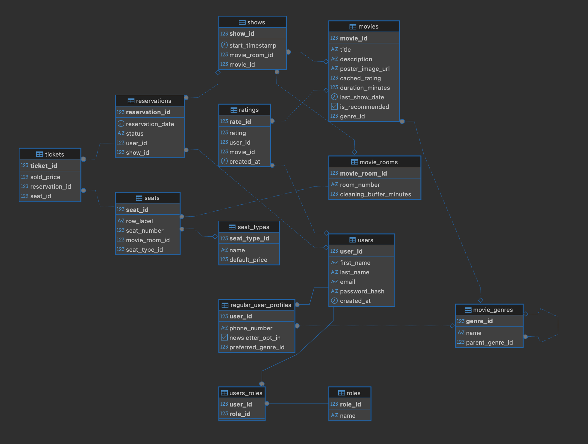

# movie_reservation_system

This will be my implementation of a movie reservation system inspired by the [roadmap.sh](https://roadmap.sh/projects/movie-reservation-system
) project idea.

## Features
* Admins perform CRUD operations on movies
* Admins can view stats related to movies
* Admins can view all reservations also those made for upcoming movies
* Admins can create other admins (there is no other way of creating the admin account!)
* Admins can „recommend” movies
* Admins are able to add movies a head of time (upcoming movies section)

* Users can make reservations for a movie at different showtimes (and cancel only only 24 hours before the show date)
* Users can view all the movies, specific dates for their show times, free seats etc.
* Users can rate movies

* Movies are categorized by genre
* Movies are bing rated by the users

* System for handling reservations
    * Users creates reservation (reservation row created, status = „PENDING”)
    * User does not complete the reservation without canceling (the row is being deleted automatically after some time)
    * If the user reserved a seat, without paying and abandons the reservation, the seat is being reserved until the reservation deletion
    * User pays for the reservation (update status to „PAID”)
    * If the user cancels the reservation, the money return is being ordered and the seat/seats are being released, status = „CANCELED”
* System for handling seat reservations and overbooking
    * Each movie room, will have certain number of seats (VIP o regular, different price for each)
    * Each seat have a row label and seat number
    * The user reserves a seat by adding a ticket to the reservation (one reservation may have many tickets)
* System for scheduling showtimes
    * The admin will be able to see the movie_room availability, and will schedule the shows based on that + each movie room will have a cleaning time, which will be added to the time between the movie shows
* Recommended, trending, last chance to watch, upcoming sections for movies on a website
    * The admins can add the movie to the recommended section, if for example movie seals poorly

## Database Design

